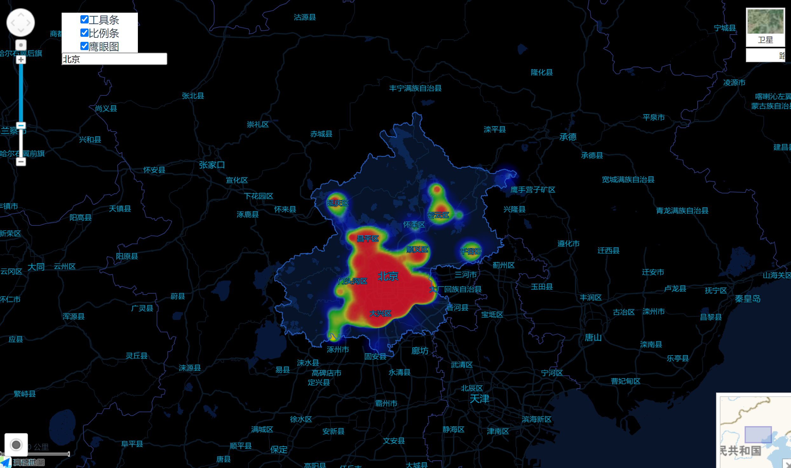

# 在Vue中使用高德地图Api

> 项目使用Vite+Vue3,Composition API(组合式API)语法<br/>
> 使用高德提供的 JSAPI Loader API加载器

高德文档：[官方文档](https://lbs.amap.com/api/jsapi-v2/guide/webcli/map-vue1)

## 运行项目
```
# 安装依赖
npm install
# 运行项目
npm run dev
```
## 实现功能
 - 地图引入
 - 同时引入：工具条控件、比例条控件、鹰眼图控件（老版）
 - 异步加载：定位插件、图层切换插件、热地图插件、行政区查询及边界绘制插件

## Demo 效果图


